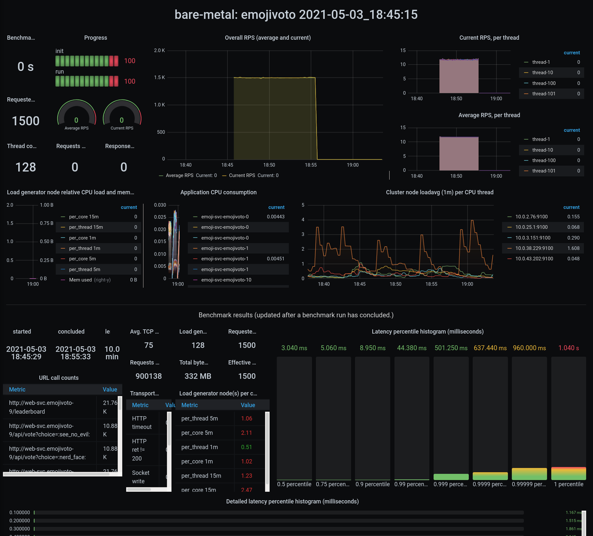

# wrk2 - emojivoto benchmark deployment (Helm)

This contains helm charts to benchmark a microservices application (emojivoto)
using wrk2 and export the results to Prometheus using pushgateway.

It also contains a correspoding Grafana dashboard.

## Running on Kubernetes

Prerequisites:
* Kubernetes cluster + access to kubectl; helm3
* Grafana, Prometheus, and the Prometheus Pushgateway set up in the cluster
* Add the [Grafana dashboard](dashboards/grafana-wrk2-cockpit.json) for this benchmark to the cluster's Grafana

### Install the deployment and run the benchmark

A [run_benchmark.sh](./run-benchmark.sh) script is provided to simplify benchmark running.

This script runs 5 iterations of the benchmark for each target Requests Per
Second (RPS) number (from 500 RPS to 5500 RPS increasing by 500 RPS each time).

Each iteration deploys 60 instances of the emojivoto app, runs wrk2 against
them with the desired RPS number, and cleans up the environment

Results are sent to Prometheus through pushgateway and shown in the Grafana dashboard.
