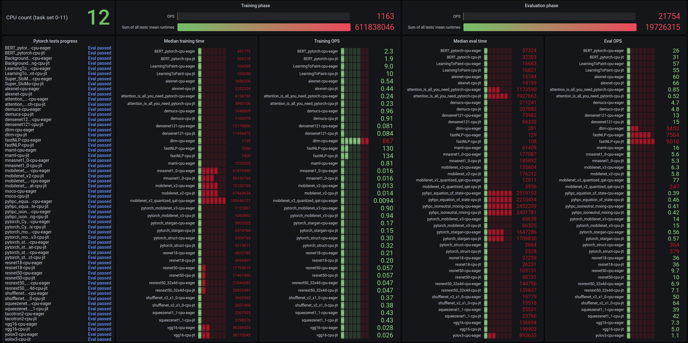
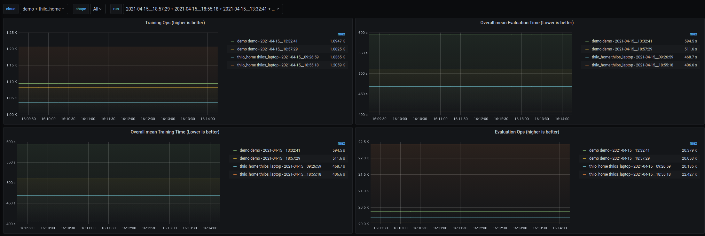

# PyTorch benchmark container and deployment (HELM)

This container provides the [pytorch](https://github.com/pytorch/benchmark) machine learning framework as well as the [pytorch-benchmark](https://github.com/pytorch/benchmark).

A convenience wrapper script, `benchmark.sh` is supplied for ease of use. The convenience script supports feeding progress and result metrics to a Prometheus [pushgateway](https://github.com/prometheus/pushgateway). A dashboard displaying progress and results is also provided.

## Dashboard in action

This dashboard displays metrics of a single run.



## Summary dashboard in action

This dashboard allows for comparing the results of multiple runs.



## Running on Kubernetes

Prerequisites:
* Kubernetes cluster + access to kubectl; helm3
* Grafana, Prometheus, and the Prometheus Pushgateway set up in the cluster
* Add the [Grafana dashboard](grafana/pytorch.dashboard) for this benchmark to the cluster's Grafana

### Install the deployment and run the benchmark

This runs the benchmark (both training and evaluation) with the recommended tests settings discussed below. Results will appear in the Grafana dashboard.

```
helm install --create-namespace pytorch-benchmark --namespace pytorch-benchmark .
```

See [helm/values.yaml](helm/values.yaml) for options and parameters.

## Cleanup / Remove after running

This removes namespace and benchmark job.

```
helm uninstall pytorch-benchmark
```

# Recommended tests

Some tests do not emit result metrics; it is recommended to exclude these using the `-k` option. Including these tests will significantly increase overall benchmark runtime without changing any of the results metrics in the Grafana dashboard, since the dashboard is based on the results output.

The tests without summary metrics are:
* Background_Matting (no training or eval summaries)
* Super_SloMo (no training or eval summaries)
* dlrm-cpu-jit (the "eager" test emits summary metrics; jit has neither training nor eval)
* maml-cpu-jit (the "eager" test emits summary metrics; jit has neither training nor eval)
* mobilenet_v2_quantized_qat-cpu-jit (the "eager" test emits summary metrics; jit has neither training nor eval)
* moco (no training or eval summaries)
* pyhpc (no training summaries)
* pytorch_CycleGAN_and_pix2pix (no training or eval summaries)
* tacotron2 (no training or eval summaries)
* yolov3 (no training summaries)

## Benchmark train and eval

Example `-k` option usage for excluding the tests above:
```shell
$ docker run -ti pytorch my-cloud my-instance-name -k 'not Background_Matting and not Super_SloMo and not dlrm-cpu-jit and not maml-cpu-jit and not mobilenet_v2_quantized_qat-jit and not moco and not pyhpc and not pytorch_CycleGAN_and_pix2pix and not tacotron2 and not yolov3'
```

## Benchmark eval only

If we only want to benchmark evaluation, we can include tests that emit eval metrics (but no training metrics). Example `-k` options usage:
```shell
$ docker run -ti pytorch my-cloud my-instance-name -k 'not test_train and not Background_Matting and not Super_SloMo and not dlrm-cpu-jit and not maml-cpu-jit and not mobilenet_v2_quantized_qat-jit and not moco and not pytorch_CycleGAN_and_pix2pix and not tacotron2'
```

# Building the image
```shell
$ docker build -t pytorch .
```

# Running the image
```shell
$ docker run -ti pytorch -h
Usage:
  docker run -ti pytorch <cloud> <instance/shape> [options]
  <cloud>          - free-form string to use for pushgateway reports
  <instance/shape> - free-form string to use for pushgateway reports
Options:
 -d                - dump pushgateway input to stdout too
 -p <push-gateway> - URL of prometheus push gateway. Default: http://pushgateway.monitoring:9091
 -n                - Do not post to pushgateway. Useful with -d.
 -k                - Only run specific tests; see https://github.com/pytorch/benchmark#examples-of-benchmark-filters.
 -c <num cpus>     - Force a number of CPUs to use (must not be higher than CPUs available).
                     By default the benchmark will use all CPUs available.

$ docker run -ti pytorch my-cloud my-instance-name
#### Running pytorch benchmark '2021-04-14__11:59:35' on cloud 'my-cloud' shape 'my-instance-name' w/ filters:''
#### CPUs: requested '' available '12' ('0'-'11', cores '12') = '12' ('0-11')
#### Test BERT_pytorch-cpu-jit phase train PASSED (1)
#### Test BERT_pytorch-cpu-jit phase eval PASSED (2)
#### Test LearningToPaint-cpu-jit phase eval PASSED (2)
...
```
